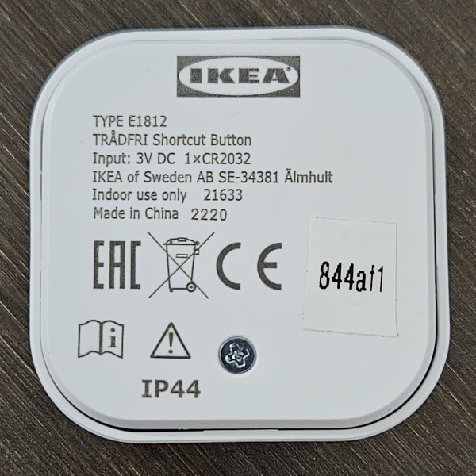
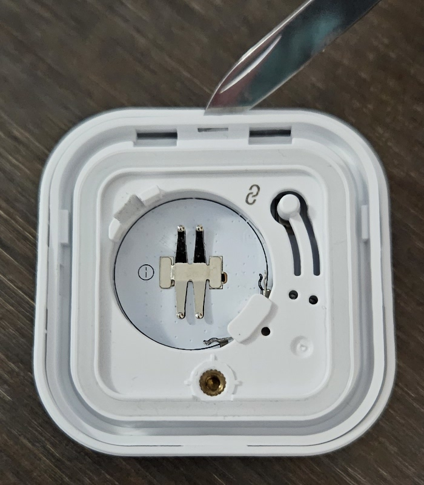
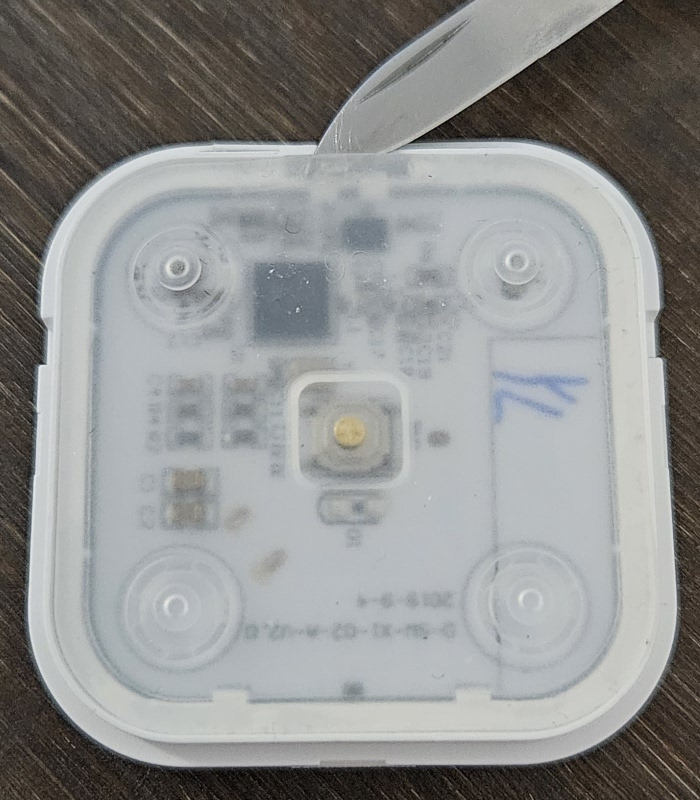
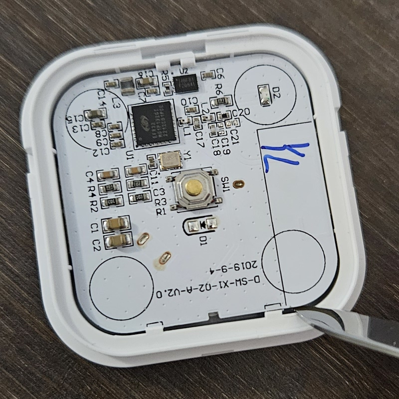
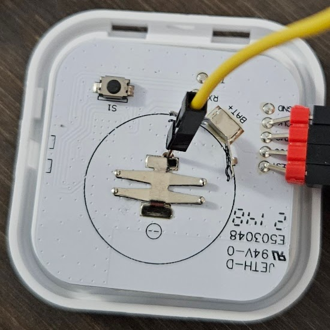
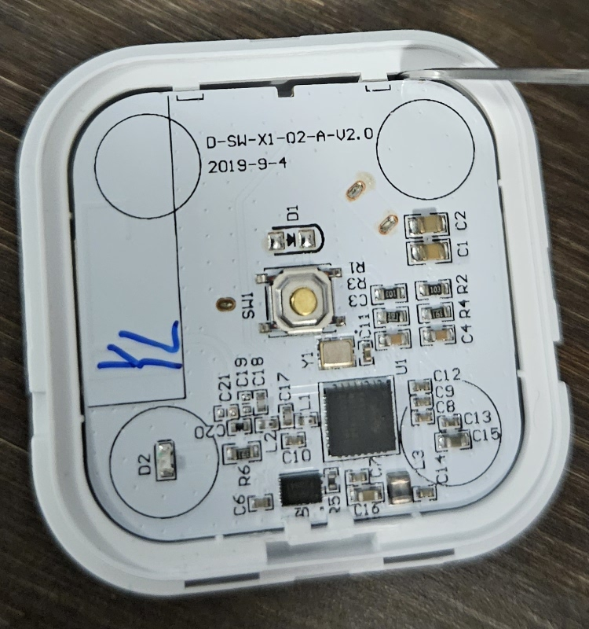

Hardware
========

The hardware PCB (Printed Circuit Board) includes a SoC with 256KB of
integrated flash. There's also a second flash chip that is assumed to be
used as temporary storage during OTA (Over The Air) firmware upgrades
that doesn't need to be accessed to modify the firmware directly.

To read/write the flash to modify the firmware requires a SWD (Serial
Wire Debug) debugger such as the `Black Magic Probe
<https://black-magic.org/>`_ and the `Arm GNU Toolchain
<https://developer.arm.com/downloads/-/arm-gnu-toolchain-downloads>`_
(or equivalents).

Opening
-------

Orient the push button so that the text on the back is facing up - this
determines where the top and bottom is.

         regulatory information

Remove the battery cover and the battery from the back.

Unclip the back of the push button starting with the top and then one
of the sides.

         right sides unclipped, indicating where to unclip at the top

On the front, carefully peel off the clear plastic membrane starting
from the top, taking care not to damage the glue around the edges.

         indicating where to start peeling it off at the top

Unclip the PCB from each side at the bottom.

         at the bottom right

Flash access
------------

Place the PCB on top of the upturned back frame so that the push button
is over the hole and won't get pressed. Carefully connect the middle of
the PCB to ground (do not push all the way through because the switch is
on the other side) and then hold the remaining 4 pin connections while
running the gdb scripts. You must connect "RESET" to be able to write to
the flash.

         wire and which pins need to be attached for the SWD interface

Holding them vertically top-down is better for stability than side-on
(as shown).

It would also be possible to hold all 5 pin connections but it may be
harder to bend all the pins into position.

The pins are labelled from top to bottom as follows:

+-------+--------+
| RESET |        |
+-------+--------+
| VCC   | 3.3V   |
+-------+--------+
| TMS   |        |
+-------+--------+
| CLK   |        |
+-------+--------+
| GND   | Ground |
+-------+--------+

Read
~~~~

Run gdb using the `read.gdb <read.gdb>`_ script to read the flash:

.. code-block:: shell

   sleep 5; arm-none-eabi-gdb --batch --command=read.gdb

Adjust the ``sleep`` as required. You have 5 seconds to make contact
with the pins and need to hold them until gdb finishes. This will take
about 3.5 seconds to run. There should be no impact if you let go early.

.. code-block:: none

   Target voltage: 3.25V
   Available Targets:
   No. Att Driver
   1       EFR32MG1P132F256 Mighty Gecko M4
   warning: No executable has been specified and target does not support
   determining executable automatically.  Try using the "file" command.
   0x0000718e in ?? ()
   A debugging session is active.

           Inferior 1 [Remote target] will be detached.

   Quit anyway? (y or n) [answered Y; input not from terminal]
   [Inferior 1 (Remote target) detached]

Write
~~~~~

Run gdb using the `write.gdb <write.gdb>`_ script to write the flash:

.. code-block:: shell

   sleep 5; arm-none-eabi-gdb --batch --command=write.gdb

Adjust the ``sleep`` as required. You have 5 seconds to make contact
with the pins and need to hold them until gdb finishes. This will take
about 11 seconds to run. If you let go too early you will need to try
again until the flash write is complete.

.. code-block:: none

   Target voltage: 3.21V
   Available Targets:
   No. Att Driver
   1       EFR32MG1P132F256 Mighty Gecko M4
   warning: No executable has been specified and target does not support
   determining executable automatically.  Try using the "file" command.
   0x0000718e in ?? ()
   Loading section .data, size 0x3e000 lma 0x0
   Start address 0x00000000, load size 253952
   Transfer rate: 23 KB/sec, 984 bytes/write.
   A debugging session is active.

           Inferior 1 [Remote target] will be detached.

   Quit anyway? (y or n) [answered Y; input not from terminal]
   [Inferior 1 (Remote target) detached]

Closing
-------

Reverse the steps to put the push button back together. Lever and clip
the PCB back in on each side at the bottom and carefully place the
plastic membrane back exactly into place. Take care to slide the
membrane into the correct position and size or button presses won't be
as smooth around the corners.

         top right clip
